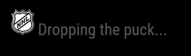
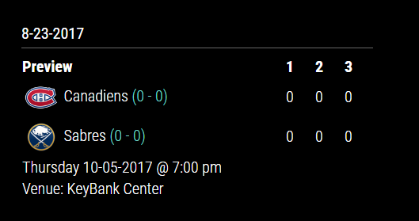

## MMM-NHL

* **NHL** module for MagicMirror2.

* Now you can have the NHL scores on your mirror!!  

* You can view entire NHL or just the team or teams you want with focus_on!

## Examples

, 

## Installation

* `git clone https://github.com/cowboysdude/MMM-NHL` into the `~/MagicMirror/modules` directory.

## Installation caveat

* Try running it WITHOUT running npm install.

* If it doesn't load run `npm install` in the `~MagicMirror/modules/MMM-Fracing` directory.

## Config.js entry and options

           {
            module: 'MMM-NHL',
            position: 'bottom_left',
            config: {
			focus_on: ['Rangers','Capitals'],  //use only if you want to focus_on team or teams otherwise leave it out
			header: true,     //See header true for yes, false for no.  Default if false
			maxWidth: "30%",  // Suggested size for module width
			headlogo: false,  //Use NHL logo in header .. must have header set to true to use
			rotateInterval: 20 * 1000 //rotates to next match every 20 seconds
			}
             },
	

